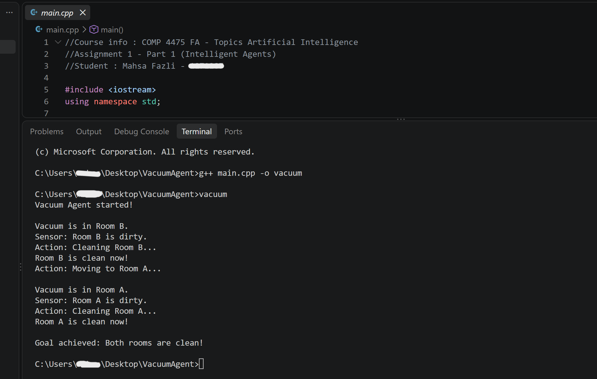

# AI Vacuum Cleaner Agent

A C++ implementation of a simple intelligent vacuum cleaner agent that perceives its environment, stores information in memory, and takes actions to achieve its goal.

## Author

Mahsa Fazli

## Project Overview

This project implements an intelligent vacuum cleaner agent that operates in two rooms: Room A and Room B. Each room can be either clean or dirty, and the agent can be located in either room.

The goal of the agent is to make both rooms clean.

The agent includes:

- **Sensors:** Detect whether the current room is clean or dirty.
- **Actuators:** Clean the current room and move between rooms.
- **Memory:** Store the known condition of each room as Unknown (`U`), Dirty (`D`), or Clean (`C`).
- **Decision-making:** If the current room is dirty, the agent cleans it. If the other room is not known to be clean, the agent moves there.

The actual condition of each room is stored separately from the agent's memory. Therefore, the agent does not know the condition of a room until it visits and senses it.

## Implementation

The program is written in C++ and repeatedly follows the intelligent agent cycle:

**Perceive → Decide → Act**

A `while` loop keeps the agent running until both rooms are known to be clean:

```cpp
while (memoryA != 'C' || memoryB != 'C')
```

When the agent visits a room, it senses its condition. If the room is dirty, the agent cleans it and updates its memory. It then moves to the other room if that room is not already known to be clean.

## Concepts Demonstrated

- Intelligent agent architecture
- Sensors and actuators
- Agent memory
- Environment perception
- Goal-based decision-making
- C++ conditionals and loops

## How to Run

Compile:

```bash
g++ main.cpp -o vacuum
```

Run:

```bash
./vacuum
```

On Windows PowerShell:

```powershell
.\vacuum.exe
```

## Program Output

The program displays the agent's perceptions, movements, cleaning actions, and a message when both rooms are clean.



## Coursework

This project was developed as part of my Artificial Intelligence coursework at Lakehead University.
